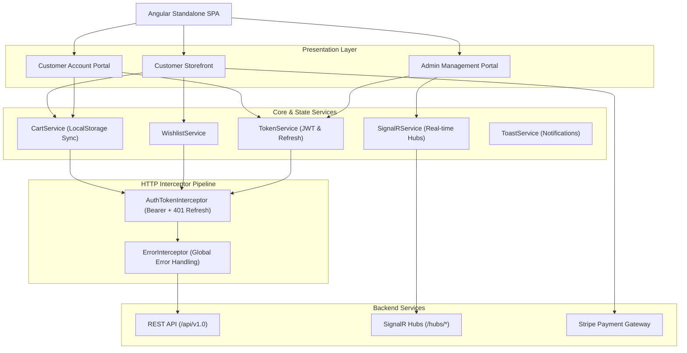
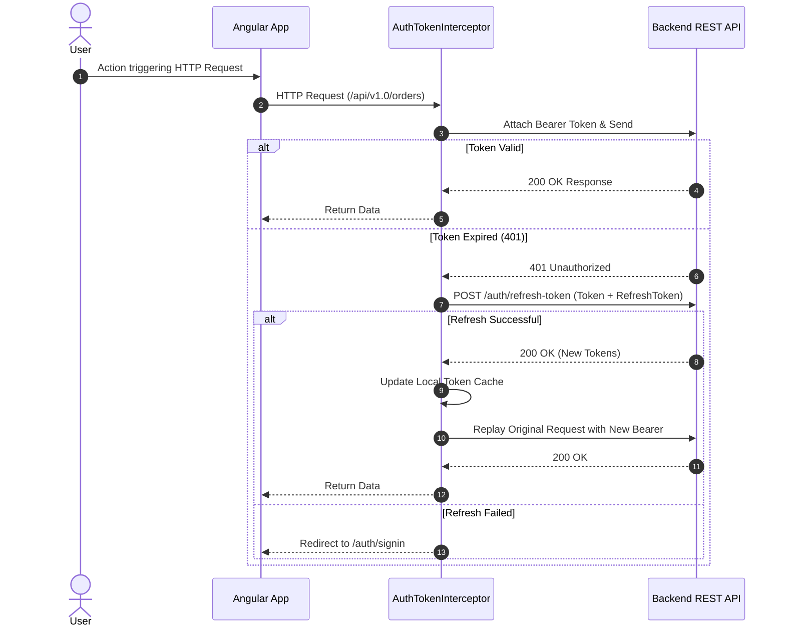

# Shopizy Frontend Architecture & Technical Design

This document outlines the architecture, design patterns, and engineering principles behind the **Shopizy** frontend application.

---

## 🏗️ Architecture Overview

Shopizy is a modern, reactive single-page application (SPA) built with **Angular (Standalone Architecture)**, **Tailwind CSS**, and **RxJS/Signals**. It communicates with a backend RESTful API and utilizes **Microsoft SignalR** for real-time order and metric updates.

---

## 📂 Key Architecture Modules

### 1. Standalone Components & Routing Architecture
- **No NgModules**: Shopizy leverages Angular's standalone components for cleaner dependency declarations, faster compilation, and tree-shakeability.
- **Route-level Lazy Loading**:
  - Main Storefront and Customer Portal routes are configured in [`src/app/app.routes.ts`](file:///d:/Projects/akazad13/shopizy-app/src/app/app.routes.ts).
  - Admin module is lazy-loaded on demand via `loadChildren` in [`src/app/admin.routes.ts`](file:///d:/Projects/akazad13/shopizy-app/src/app/admin.routes.ts).
- **Route Resolvers**: Resolvers like [`ProductDetailResolver`](file:///d:/Projects/akazad13/shopizy-app/src/app/resolvers/product-details.resolver.ts) and [`OrderDetailResolver`](file:///d:/Projects/akazad13/shopizy-app/src/app/resolvers/order-details.resolver.ts) prefetch data before route activation to ensure seamless transitions.

---

### 2. Authentication, Token Lifecycle & Guards

The authentication pipeline guarantees secure access, role enforcement, and transparent token renewal:

- **JWT Storage**: [`TokenService`](file:///d:/Projects/akazad13/shopizy-app/src/app/services/token.service.ts) manages access tokens, refresh tokens, user metadata, and role extraction (`jwt-decode`).
- **Auth Token Interceptor** ([`authTokenInterceptor`](file:///d:/Projects/akazad13/shopizy-app/src/app/interceptors/auth-token.interceptor.ts)):
  - Automatically attaches `Authorization: Bearer <token>` to all API requests.
  - Automatically excludes authentication endpoints (login, register, refresh).
  - Intercepts `401 Unauthorized` responses and silently performs a refresh token exchange via `AuthApi.refreshToken()`, retrying the original request on success.
- **Route Guards** ([`AuthGuard`](file:///d:/Projects/akazad13/shopizy-app/src/app/guards/auth.guard.ts)):
  - Enforces route protection for authenticated users.
  - Supports role validation (e.g., `data: { roles: ['Admin'] }`).
  - Supports `redirectToDashboard` mode for login/signup pages when already authenticated.

---

### 3. State Management & Core Services

Shopizy uses focused, reactive services with RxJS `BehaviorSubject` and `Observable` patterns:

| Service | Responsibility | Persistence |
|---|---|---|
| [`CartService`](file:///d:/Projects/akazad13/shopizy-app/src/app/services/cart.service.ts) | Item additions, quantities, stock validation, promo code discounts, gift cards, calculations | `localStorage` sync |
| [`WishlistService`](file:///d:/Projects/akazad13/shopizy-app/src/app/services/wishlist.service.ts) | Wishlist item state, adding/removing items, backend synchronization | API + Reactive State |
| [`SignalrService`](file:///d:/Projects/akazad13/shopizy-app/src/app/services/signalr.service.ts) | WebSockets connections to Orders and Admin hubs, automatic reconnection | Connection State |
| [`ToastService`](file:///d:/Projects/akazad13/shopizy-app/src/app/services/toast.service.ts) | Notification queue (success, error, info, warning) with auto-dismiss timers | In-memory |
| [`TokenService`](file:///d:/Projects/akazad13/shopizy-app/src/app/services/token.service.ts) | Token storage, decoded payload, role retrieval, expiration verification | `localStorage` sync |

---

### 4. Real-time Architecture (SignalR)

Shopizy integrates **Microsoft SignalR** for live bidirectional communication:

1. **Orders Hub (`/hubs/orders`)**:
   - Subscribes customer and order pages to live order status transitions (`Pending` -> `Confirmed` -> `Shipped` -> `Delivered`).
   - Dispatches [`OrderStatusUpdateEvent`](file:///d:/Projects/akazad13/shopizy-app/src/app/services/signalr.service.ts) to active UI components.
2. **Admin Dashboard Hub (`/hubs/admin-dashboard`)**:
   - Streams live sales metrics, order counts, and system alerts to the administrative dashboard without manual page refreshes.
3. **Resilience**:
   - Implemented with `.withAutomaticReconnect()` and event handlers for `onreconnected` and `onclose`.

---

### 5. Payment Gateway Integration (Stripe)

- Built with **ngx-stripe** and **@stripe/stripe-js**.
- Custom payment form handling payment method confirmation, client secrets, card element styling, and processing state indicators.
- Seamless redirection to order confirmation upon successful settlement.

---

### 6. Design System & SVG Sprite Iconography

- **Tailwind CSS**: Utility-first styling with customized color palette, typography, form extensions, and responsive breakpoints.
- **SVG Sprite Sheet**: Centralized icon repository located in [`public/icons.svg`](file:///d:/Projects/akazad13/shopizy-app/public/icons.svg) referenced by `<app-icon>`. Reduces DOM overhead and leverages browser HTTP caching. (See [`ICONS_GUIDE.md`](file:///d:/Projects/akazad13/shopizy-app/ICONS_GUIDE.md)).
