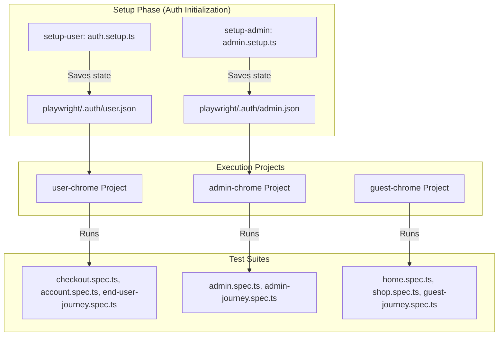

# Shopizy End-to-End (E2E) Testing Guide

Shopizy uses **[Playwright](https://playwright.dev/)** for fast, reliable, cross-browser end-to-end testing. This document covers our testing strategy, project configurations, authentication fixtures, and debugging workflows.

---

## 🎯 Testing Architecture & Strategy

Shopizy's E2E test suite implements a **multi-persona testing architecture** to test user flows under different authorization contexts without repetitive login steps.



---

## 👥 Personas & Projects

| Project Name | Setup Dependency | Storage State File | Target Specs |
|---|---|---|---|
| `setup-user` | None | `playwright/.auth/user.json` | Authenticates standard customer persona |
| `setup-admin` | None | `playwright/.auth/admin.json` | Authenticates administrator persona |
| `user-chrome` | `setup-user` | Reuses `user.json` | Authenticated checkout, order history, wishlist, profile |
| `admin-chrome` | `setup-admin` | Reuses `admin.json` | Admin dashboard, product CRUD, order processing, categories, brands |
| `guest-chrome` | None | Clean state (No auth) | Public browsing, search, filter, guest cart, auth pages |

---

## 🚀 Running E2E Tests

### 1. Prerequisites
Ensure the backend API service is running (default: `http://localhost:5054` or configured API port) and browser binaries are installed.

```bash
# Install Playwright browser binaries (one-time setup)
npx playwright install
```

### 2. Run All Tests (Headless)
Runs all test projects concurrently, automatically launching the dev server on port `4200` if not already running:

```bash
npm run test:e2e
```

### 3. Interactive UI Mode
Opens Playwright's interactive test runner with time-travel debugging, DOM inspection, and live preview:

```bash
npm run test:e2e:ui
```

### 4. Running Specific Projects

To run tests for a specific persona:

```bash
# Run only standard customer flows
npx playwright test --project=user-chrome

# Run only admin dashboard & management flows
npx playwright test --project=admin-chrome

# Run only guest customer & catalog flows
npx playwright test --project=guest-chrome
```

### 5. Running a Specific Test File

```bash
npx playwright test e2e/checkout.spec.ts
npx playwright test e2e/admin-journey.spec.ts
```

---

## 📊 Viewing Test Reports & Traces

After test execution, Playwright generates a detailed HTML report and traces on failure:

```bash
# View last generated HTML report
npx playwright show-report

# View trace file for a failed test
npx playwright show-trace test-results/<test-name>/trace.zip
```

---

## 🛠️ Best Practices for Writing E2E Tests

1. **Leverage Auth Fixtures**: Do not write explicit login steps inside `user-chrome` or `admin-chrome` tests. The session is automatically injected via `storageState`.
2. **Use Semantic Locators**: Prefer Playwright's user-facing locators:
   ```typescript
   // Preferred
   await page.getByRole('button', { name: /checkout/i }).click();
   await page.getByPlaceholder('Search products...').fill('headphones');
   
   // Avoid fragile CSS/XPath
   await page.locator('div > div:nth-child(3) > button').click();
   ```
3. **Handle Dynamic API Delays**: Use Playwright's built-in web assertions which auto-retry until the condition is met:
   ```typescript
   await expect(page.getByText('Order Placed Successfully')).toBeVisible();
   ```
4. **Isolate Test Data**: Keep test assertions resilient to variable catalog data by targeting data attributes or stable test fixtures.
